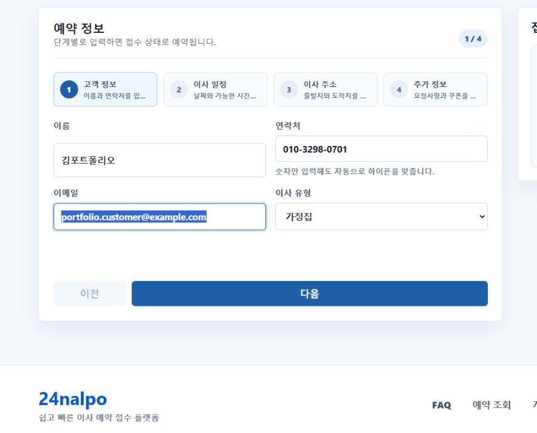
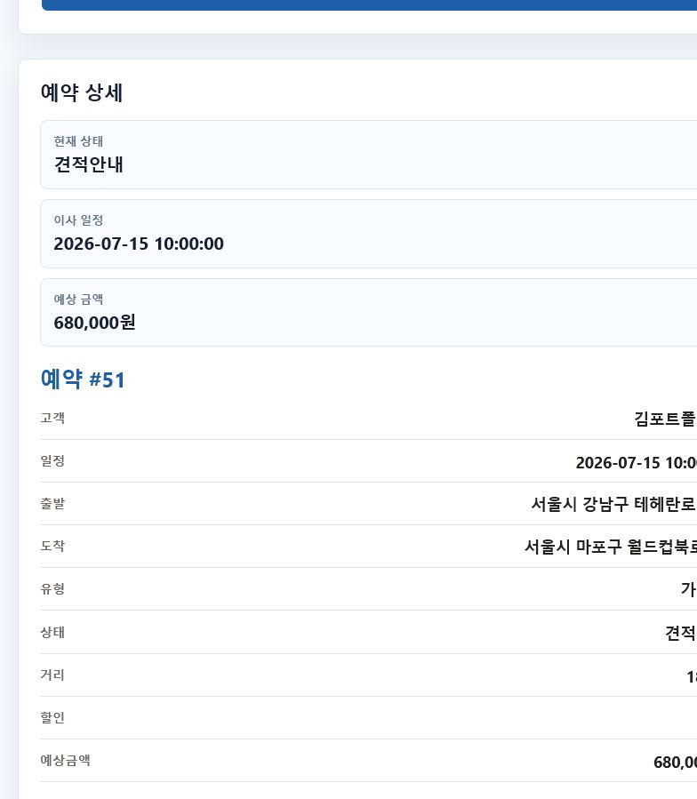
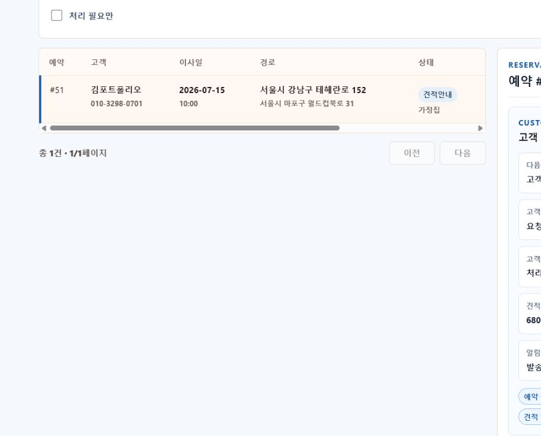
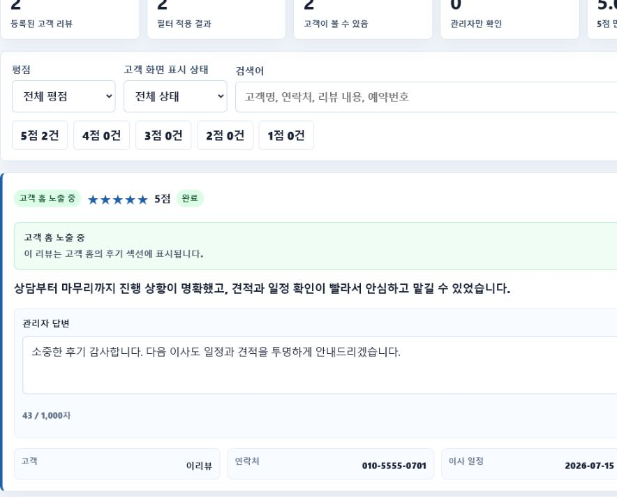

# 24nalpo

이사 예약 접수부터 관리자 운영, 견적, 알림, 후기까지 한 흐름으로 관리하는 개인 프로젝트입니다.

Spring Boot가 예약 규칙과 REST API를 담당하고, React가 고객 및 관리자 화면을 제공합니다. 일반 이사 예약과 비영리 이사 도움 요청 흐름을 함께 지원합니다.

- 배포 화면: [https://24nalpo.vercel.app](https://24nalpo.vercel.app)
- 개발 형태: 개인 프로젝트
- 핵심 흐름: `예약 접수 -> 관리자 확인 -> 견적 안내 -> 고객 동의 -> 일정 확정 -> 완료 및 후기`

## 실제 화면

| 고객 예약 | 예약 조회 |
| --- | --- |
|  |  |
| 단계형 폼에서 고객 정보, 일정, 주소를 입력합니다. | 예약번호와 연락처로 진행 상태와 견적을 확인합니다. |

| 관리자 예약 관리 | 리뷰 관리 |
| --- | --- |
|  |  |
| 처리 우선순위, 견적, 상태, 알림을 한 화면에서 관리합니다. | 공개 여부와 관리자 답변을 관리합니다. |

## 주요 기능

- 고객: 예약 신청과 임시 저장, 가능 시간 확인, 예약 조회, 수정·취소 요청, 사진 업로드, 후기 작성
- 관리자: 예약 목록과 상세 처리, 견적·상태 관리, 고객 요청 승인/반려, 일정·휴무일 설정
- 운영: 이메일·SMS 알림 이력, FAQ, 리뷰, 서비스 모드와 견적 정책 관리
- 보안: 관리자 인증, 예약 조회 시도 제한, 개인정보 마스킹·암호화, 파일 업로드 검증, 감사 로그

## 기술 스택

| 영역 | 기술 |
| --- | --- |
| Backend | Java 17, Spring Boot 3.3.6, Spring Security, Spring Data JPA |
| Frontend | React, TypeScript, Vite |
| Data | MySQL, 파일 업로드 저장소 |
| Build/Deploy | Maven, GitHub Actions, Vercel, Railway |

## 로컬 실행

MySQL에 `movemission` 데이터베이스를 만든 뒤 Bash 터미널 두 개를 사용합니다.

```bash
cp .env.example .env.local
bash run-backend.sh
```

새 터미널에서:

```bash
bash run-frontend.sh
```

```text
고객/관리자 React  http://localhost:5173
Spring Boot API    http://localhost:8081
```

실행 상태는 `bash check-local.sh`로 확인할 수 있습니다. 환경변수와 관리자 계정 설정은 [실행 문서](docs/RUNNING.md)를 참고합니다.

## 검증

```bash
mvn test
cd frontend
npm run lint
npm run build
```

## 문서

| 문서 | 용도 |
| --- | --- |
| [아키텍처](docs/ARCHITECTURE.md) | 프로젝트 구조와 예약 상태 흐름 |
| [REST API](docs/API.md) | API 요청·응답과 인증 기준 |
| [실행 및 환경 설정](docs/RUNNING.md) | 로컬 실행, 테스트, 환경변수, 계정 설정 |
| [관리자 기능](docs/ADMIN.md) | 관리자 메뉴와 운영 처리 기준 |
| [디자인 가이드](docs/DESIGN.md) | 고객·관리자 UI/UX 기준 |
| [테스트 시나리오](docs/TEST_SCENARIOS.md) | 주요 기능 수동 검증 순서 |
| [배포 가이드](docs/DEPLOY_VERCEL_RAILWAY.md) | Vercel·Railway 배포 방법 |
| [포트폴리오 케이스 스터디](docs/PORTFOLIO_CASE_STUDY.md) | 문제 해결 과정과 면접 설명 자료 |
| [로드맵](docs/ROADMAP.md) | 다음 개발 우선순위 |

세부 운영·배포 문서는 [`docs`](docs) 폴더에 목적별로 분리되어 있습니다.
